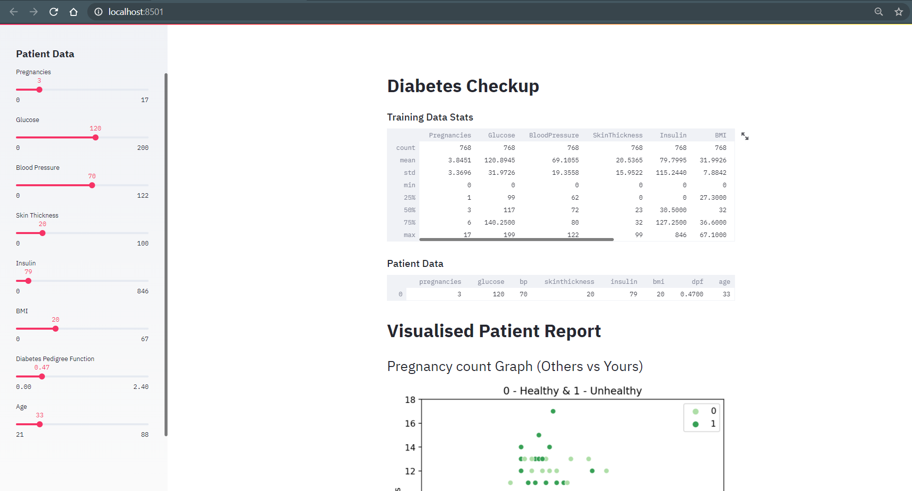

# Diabetes Prediction System using ML
Title: Diabetes Prediction System using ML

Description:
Welcome to the Diabetes Prediction System using ML repository! Here, you'll find an innovative machine learning project that aims to predict the likelihood of an individual developing diabetes based on certain input features. This repository houses the code and resources necessary to understand, implement, and improve upon the diabetes prediction model.

## About the Project:
Diabetes Prediction System using ML is an open-source project that leverages the power of machine learning algorithms to predict the probability of a person developing diabetes. With the increasing prevalence of diabetes worldwide, early detection and proactive management have become crucial. This project aims to aid healthcare professionals and individuals alike in identifying the risk factors associated with diabetes, enabling early intervention and lifestyle modifications.

## Key Features:
- Dataset: The repository provides a comprehensive dataset containing various medical and demographic attributes of individuals, including age, BMI, glucose levels, insulin resistance, blood pressure, and more. This dataset serves as the foundation for training the diabetes prediction model.
- Machine Learning Models: The project incorporates state-of-the-art machine learning algorithms, such as logistic regression, random forest, and support vector machines, to build accurate prediction models. These models are designed to analyze the dataset and predict the likelihood of an individual developing diabetes.
- Model Evaluation: The repository includes code snippets and utilities for evaluating the performance of the prediction models. It provides metrics such as accuracy, precision, recall, and F1-score to assess the effectiveness of the models in identifying diabetes cases.
- Jupyter Notebooks: The project offers Jupyter notebooks that provide detailed explanations of the data preprocessing, feature engineering, model training, and evaluation steps. These notebooks serve as a comprehensive guide for understanding and implementing the diabetes prediction system.
- Documentation: The repository contains detailed documentation that explains the project's structure, provides usage instructions, and offers insights into the various components and techniques employed in the diabetes prediction model.

## Getting Started:
To get started with the Diabetes Prediction System using ML project, follow these simple steps:
1. Clone the repository to your local machine using the provided link.
2. Install the required dependencies and libraries mentioned in the documentation.
3. Explore the Jupyter notebooks to gain insights into the data preprocessing, model training, and evaluation processes.
4. Run the provided code snippets to experiment with different algorithms and evaluate their performance.
5. Contribute to the project by suggesting improvements, enhancing the existing models, or adding new features to increase the accuracy and robustness of the predictions.

## Contributions and Feedback:
We welcome contributions from the open-source community to enhance the Diabetes Prediction System using ML project. If you have any suggestions, feature requests, or bug reports, please create an issue in the repository. Additionally, we encourage you to submit pull requests with your proposed changes or improvements.

We believe that the Diabetes Prediction System using ML project can make a significant impact on the early detection and management of diabetes, ultimately improving the quality of life for millions of people worldwide. Join us in our mission to create a powerful and accessible tool for predicting diabetes risk!

Note: The Diabetes Prediction project is intended for research and educational purposes only. It should not replace professional medical advice or diagnosis.
Preview of the Project

